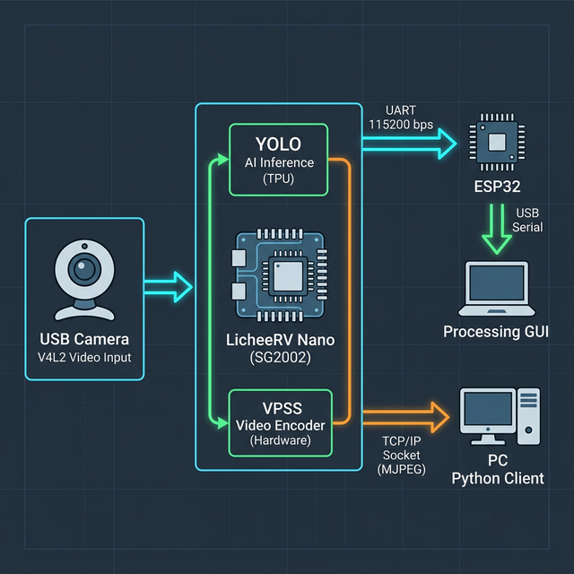
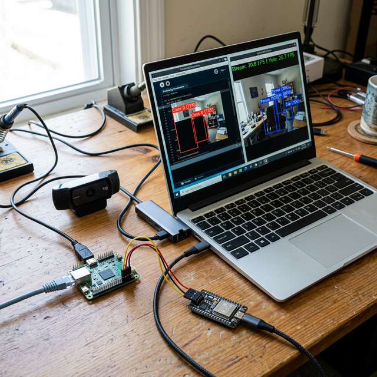

# LicheeRV Nano YOLO Camera Streamer


<br>


A high-performance C++ application for the LicheeRV Nano (SG2002/CV1800B) that streams live MJPEG video while running YOLO object detection simultaneously using the built-in Hardware TPU (TDL).

## Features

- **Dual-Channel VPSS**: Utilizes the Video Processing Subsystem to create two hardware-accelerated branches from a single camera input:
  - Branch 1: High-resolution NV12 frame → HW JPEG Encoder (VENC) → Network Stream.
  - Branch 2: Rescaled RGB planar frame → HW TPU (YOLO Inference).
- **High Performance & Low Latency**:
  - **V4L2 USERPTR Zero-Copy**: Directly captures frames into Video Buffer (VB) memory, eliminating CPU `memcpy` overhead.
  - **Decoupled I/O threads**: Dedicated YOLO thread and JPEG network broadcast thread to ensure the camera capture pipeline is never blocked.
  - **Multi-client support**: Supports up to 4 concurrent MJPEG clients without lagging the camera.
- **Hardware Integration**:
  - **Status LED (A24/GPIO 504)**: Remains ON constantly when system is running successfully.
  - **Detection LED (A23/GPIO 503)**: Automatically turns ON when YOLO detects an object, helping with headless debugging.
  - **Standalone Reset Button**: A background daemon (`reset_btn`) that safely resets the IP and reboots the board if an external button on **A27 (GPIO 507)** is held for 5 seconds using interrupt-based polling.
  - **UART Serial Output ($YOLO NMEA)**: Broadcasts bounding boxes in an NMEA-like format via UART (e.g., `/dev/ttyS0`) for easy parsing by external microcontrollers like Arduino or ESP32.
- **Python IPC Client**: Includes a Python client (`otg_camera_client.py`) using raw sockets to view the stream and overlay YOLO bounding boxes remotely over WiFi/USB-OTG.

## Prerequisites

- LicheeRV Nano board with camera module.
- Cross-compilation toolchain for RISC-V (SG2000/SG2002 SDK).
- Pre-compiled YOLO model in `.cvimodel` format (e.g., `yolov8n_coco_640.cvimodel`).

## Build Instructions

On your Linux build machine (with the SDK environment configured):

```bash
mkdir build
cd build
cmake ..
make -j$(nproc)
```

Transfer the resulting `Yolo_CSIStream` binary to your board.

## Usage

Run the executable on the LicheeRV Nano:

### Normal Mode (Stream + YOLO Detection)
```bash
./Yolo_CSIStream yolov8n_coco_640.cvimodel
```

### Stream-only Mode (Lowest CPU)
Disable YOLO inference to save CPU and VPSS bandwidth:
```bash
./Yolo_CSIStream dummy --no-yolo --quality 80
```

### UART Output for ESP32/Arduino
Specify the UART device and baudrate to output NMEA-formatted YOLO detections:
```bash
./Yolo_CSIStream yolov8n_coco_640.cvimodel --uart /dev/ttyS0 --baud 115200
```
> **Note:** `/dev/ttyS0` is UART0 mapped to pins **A16 (TX)** and **A17 (RX)** on the LicheeRV Nano. Since it is also used as the default debug console, you might see kernel or login logs mixed with the UART output. You can disable kernel logs printing to the console with `echo 0 > /proc/sys/kernel/printk`.

### Physical IP Reset Button
If you lose the IP configuration, solder a push-button between **A27 (GPIO 507)** and **GND**.
Hold the button for **5 seconds**, and the daemon will automatically reset `eth0` back to `192.168.100.2` and reboot the system safely.
Note: A27 natively supports an internal pull-up resistor on boot, making it rock-solid for this operation without external resistors.

## Viewing the Stream

### Browser View
Simply open `http://<LICHEERV_IP>:8080` in any web browser to view the live MJPEG stream (video only).

### Python Client (with Bounding Boxes)
Run the provided Python client on your PC to view the stream with overlaid YOLO boxes:
```bash
cd python_client
pip install opencv-python numpy
python otg_camera_client.py
```

## UART Data Format

The UART serial data follows an easy-to-parse NMEA-like protocol:
```
$YOLO,<ts_ms>,<count>[,<cls>,<x1>,<y1>,<x2>,<y2>,<score>]*<XX>\r\n
```
- `<ts_ms>`: Timestamp
- `<count>`: Number of objects detected
- `*<XX>`: XOR checksum

View `esp32_test.h` for an example Arduino sketch to read and parse this data.
